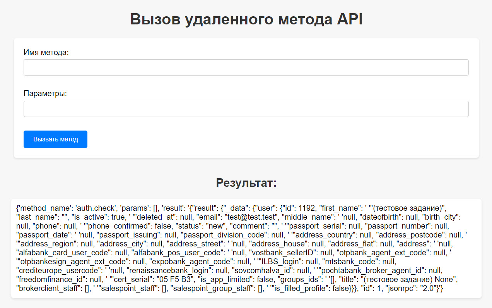
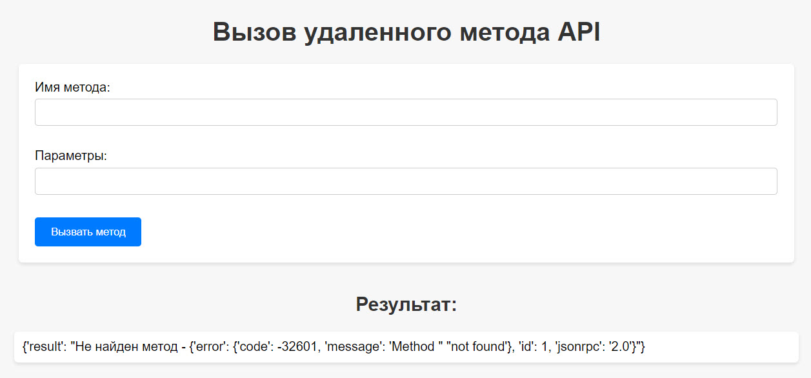

# Проект "Клиент к существующему jsonrpc-сервису"
### Заберов Дмитрий (zaberov.dv@internet.ru)

### Описание
Django-проект, при помощи которого используя jsonrpc-2.0 (эндпоинт: https://slb.medv.ru/api/v2/ ) можно вызвать удалённый метод api с использованием для авторизации предоставленной пары сертификат+ключ (т.н. "двусторонний TLS").

Содержимое сертификата и ключа прописывается в **settings.py** в виде текстовых переменных.

Использовалась только стандартная библиотека python (помимо django).

Для примера вызывается jsonrpc-2.0 метод "auth.check".

## Технологии
1.  Python 3.11.
2.  Django 4.2.13.
3.  JSON-RPC 2.0.

## Установка и использование
Порядок работы:
   - Сделайте Fork этого репозитория. Клонируйте форкнутый репозиторий, чтобы получить его локально.
   - Перейдите в директорию проекта.
   - Создайте и активируйте виртуальное окружение:

   `poetry init`
   `poetry shell`
   - Установите зависимости проекта (зависимости, необходимые для установки, можно найти в файле **pyproject.toml**):
   `poetry install`
   - Запустите сервер командой `python manage.py runserver`.
   - В браузере перейдите по ссылке http://127.0.0.1:8000/call-api/. Для проверки работы в поле **Имя метода** ввести `auth.check`, поле **Параметры** можно оставить пустым. Результат запроса виден на html-странице ниже заголовка **Результат**. Работа приложения проиллюстрирована ниже.

## Тестирование
Код покрыт тестами на 100%.
1. Настройки в файле **.coveragerc**
2. Из директории проекта запустить команду тестирования `python manage.py test`
3. После успешного прохождения тестов запустить следующие команды для формирования отчёта(-ов):
    - запуск тестов конкретных приложений с выводом подробностей тестирования: `coverage run --source='httpclient'  manage.py test -v 2`
    - вывод результатов тестирования в виде отчёта в терминал: `coverage report --skip-covered`
    - вывод результатов тестирования в виде html-отчёта: `coverage html --skip-covered`

## Особенности
### Проект содержит одно приложение:
1.  httpclients – клиент к существующему jsonrpc-сервису.

### Технические особенности:
1. Константы эндпоинта (ENDPOINT), сертификата (CERTIFICATE_CONTENT) и ключа (PRIVATE_KEY_CONTENT) хранятся в файле **settings.py** проекта в виде данных строкового типа.
2. При замене значений вышеуказанных констант, никаких дополнительных изменений в коде не требуется для того, чтобы подключится к другому эндпоинту, чтобы вызвать удалённый метод api с использованием для авторизации предоставленной корректной пары сертификат+ключ.
3. Поскольку в рамках указанного проекта (задания) не понятно, какие параметры должны передаваться в запросе, то я предположил, что это может быть последовательность целых чисел в виде списка. Поэтому обработка данных, вводимых пользователем в поле Параметры, осуществляется исходя из этой логики. При необходимости передавать другие типы данных, функцию `str_in_list_of_int()`, находящуюся в файле **utils.py**, можно легко отредактировать. При этом важно, чтобы она передавала итерируемую последовательность значений (в данном случае - список).

### Установка зависимостей
Зависимости, необходимые для работы и тестирования проекта указаны в **pyproject.toml**.
